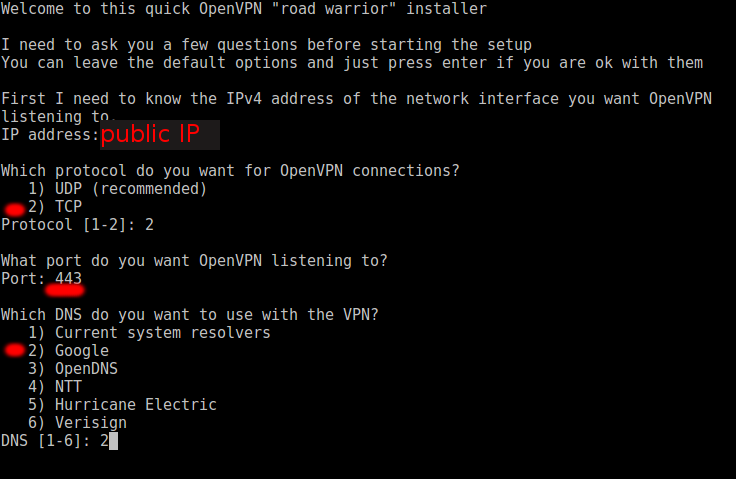

# openvpn
openvpn easy installation

```bash
wget https://raw.githubusercontent.com/Xaqron/openvpn/master/install.sh
sudo bash install.sh
```

During installation you need to specify some configurations:
* Your machine `public IP` address
* Although `UDP` protocol is recommended, you need to use `TCP` if you are gonna redirect traffic via [stunnel](https://www.stunnel.org) later.
* openvpn uses `UDP 1194` as default protocol/port. If you plan to use `stunnel` then a port like `443` or `578` over `TCP` protocol is less suspicious.
* Use Google as `DNS` provider (option two).



If you have no plan for redirecting traffic via `stunnel` then just proceed with default options (except for `DNS` provider which is recommended to be used the google ones).